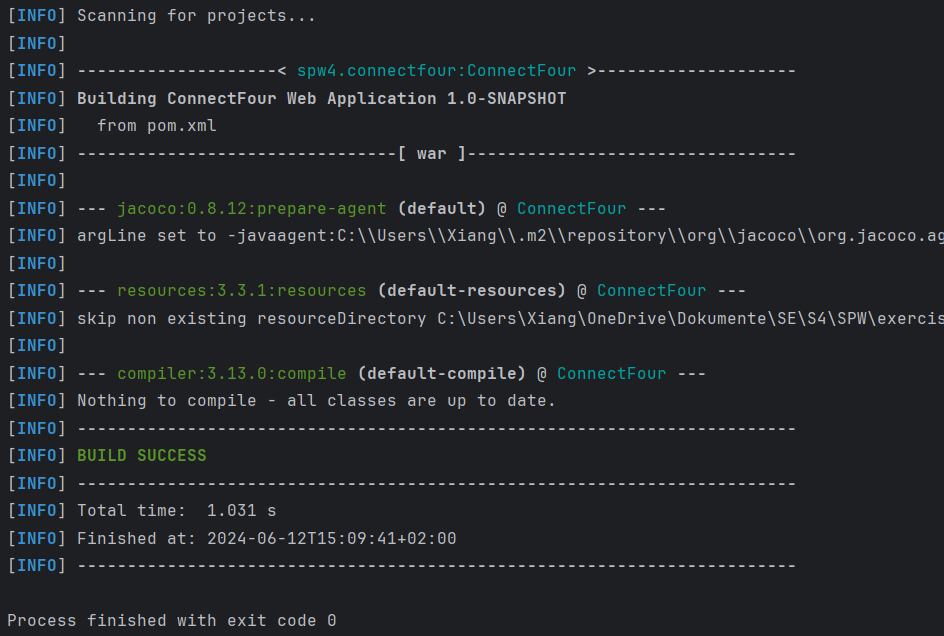
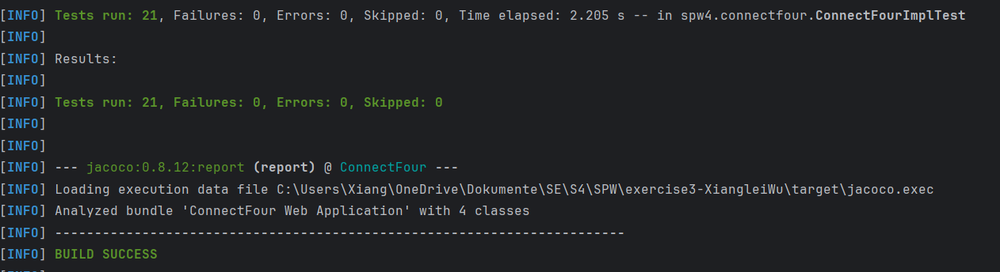
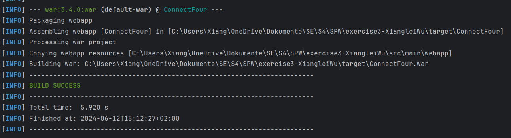
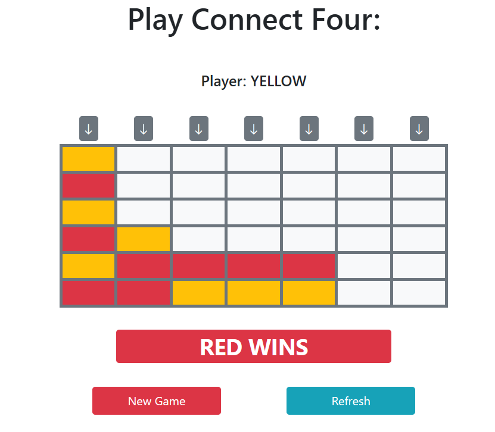
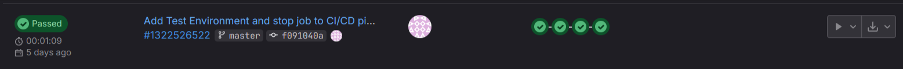
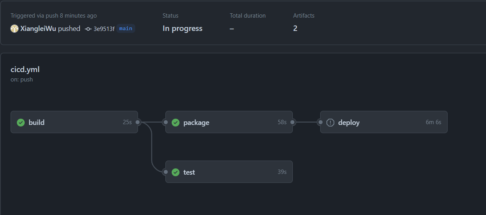

SPW4 - Exercise 3
=================

Name: Xianglei Wu

Effort in hours: 4

## 1. Connect Four Web Application and CI/CD Pipeline

### Task 1.a
Wurde in der Übung gemacht.

mvn compile:

mvn test: 

mvn package:

mvn tomcat7:run auf localhost:8080/ConnectFour

### Task 1.b

Wurde in der Übung gemacht. 

### Task 1.c

Github Actions wurde so wie laut setup.md aufgesetzt.

Für die workflow-Datei:

Bei dem Pipeline wird der Build, Test und Package bei jedem Push und Pull_request ausgeführt und rennen alle auf dem selbst gehosteten Runner.

Build: 

Caches die Maven Pakte um das Builden zu für nachfolgende Builds zu verschnellern. Es kompiliert ConnectFour und speichert die Artifakte auf ein selbsterzeugten Staging Verzeichnis.

Test: 

Entnimmt die gecachten Maven Pakete. Laded die Artifakte herunter und führt die Tests durch.

Package:
Entnimmt die gecachten Maven Pakete. Laded die Artifakte herunter und packt ConnectFour zu einem War-Datei zusammen und laded die als Verpackte Artefakt hoch.

Deploy:
Mir ist dies hier nicht gelungen, weil der Runner die Docker Commandos nicht ausführen kann. 

Mein Repository für die 1.c
https://github.com/XiangleiWu/ConnectFour